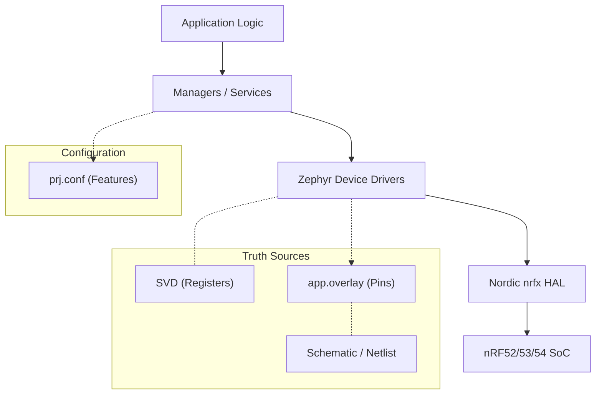
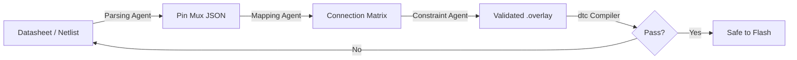

# ⚡️ embedded_Skill_nRF_Connect

<div align="center">


**The "Missing Manual" for nRF Connect SDK (NCS) Development.**  
*Bridging the gap between "Hello World" and Enterprise-Grade Firmware — with a strict Hardware Truth workflow.*

[Getting Started](#-getting-started) •
[Philosophy](#-philosophy) •
[Knowledge Brain](#-the-knowledge-brain-context) •
[AI Strategy](#-ai-strategy-beyond-text-generation) •
[Star History](#-star-history)

</div>

---

## 🚀 Why This Exists

The nRF Connect SDK (Zephyr RTOS) is powerful but unforgiving. A single wrong pin number or a mismatched register write can **permanently brick** your hardware.

This repository is an **AI-Enhanced Knowledge Base & Skill Library** that enforces:

1.  🛡️ **Anti-Bricking Protocols**: Mandatory safety checks for UICR, PMIC, and Multi-core chips.
2.  📐 **Hardware Truth Verification**: Pinouts and registers **MUST** originate from Data Sheets, Netlists, and SVD files — never from memory or generic training data.
3.  🏗️ **Production-Grade Patterns**: From Blinky to Multi-image, Multi-core, IoT-Cloud applications.

---

## 🧘 Philosophy

> **"Embedded code is NOT portable between chip generations. Code without a verified pinout is a liability, not an asset."**

We operate on three non-negotiable principles:

| Principle | Rule |
| :--- | :--- |
| **Hardware Truth** | Never trust AI-generated pin numbers. Always verify against the **Data Sheet**, **Board Schematic / Netlist**, and **DeviceTree (`.dts`)** output. nRF52 ≠ nRF53 ≠ nRF54. |
| **Overlay First** | If a physical wire exists, it MUST be defined in `app.overlay`. We do not hardcode pins in `.c` files. |
| **OS Native** | Use Zephyr Drivers, Workqueues, and Logging — do not reinvent the wheel. |

---

## 🧠 The Knowledge Brain (`context/`)

14 curated context files, organized by purpose. **Start from the [Knowledge Map](context/ncs_knowledge_map.md).**

### 📜 The Constitution
| File | Role |
| :--- | :--- |
| [Engineering Standards](context/ncs_engineering_standards.md) | Golden rules for threading, decoupling, and West workflow. |
| [Anti-Bricking Rules](context/critical_safety_rules_antibricking.md) | UICR, PMIC, and Multi-core safety checks. |

### 🔧 Core Skills
| File | Role |
| :--- | :--- |
| [NCS Fundamentals](context/ncs_fundamentals_guide.md) | **Academy Core**: DeviceTree, GPIO API, Kconfig, Logging (Lessons 2-4). |
| [Zephyr Basics](context/zephyr_basics.md) | DeviceTree syntax, Kconfig, Driver Model. |
| [Peripherals](context/zephyr_peripherals.md) | Gold-standard GPIO / I2C / SPI patterns. |
| [BLE Core Guide](context/ble_core_guide.md) | BLE stack, roles, advertising, and production tips. |
| [J-Link Debug Guide](context/jlink_debug_guide.md) | RTT logging, J-Link Commander recovery, multi-core debug. |
| [Project Structure](context/ncs_project_structure.md) | `boards/`, `child_image/`, `src/modules/` layout. |

### 🏛️ Real-World Case Studies
| File | Role |
| :--- | :--- |
| [Seeed XIAO Master Guide](context/seeed_xiao_master_guide.md) | **nRF52840 vs nRF54L15**: Battery traps, UART boot issues, Protocol capabilities. |
| [XIAO BLE Architecture](context/xiao_ble_architecture.md) | Deep dive into nRF52840 dual-core strategy (Mbed vs Zephyr). |
| [Meow Sense Tag Lessons](context/meow_sense_tag_lessons.md) | **Hard-won lessons**: nRF5340, BQ25120A PMIC, anti-bricking rescue ops. |
| [Real World Architectures](context/real_world_architectures.md) | *OpenEarable*, *Seeed*, *MakerDiary* — module vs bare-chip. |

### 🤖 AI Agent Strategy
| File | Role |
| :--- | :--- |
| [AI Embedded Skill Roadmap](context/ai_embedded_skill_roadmap.md) | **From Text → Structured Logic**: SVD parsing, Netlist graphs, Grammar-Constrained Decoding. |

---

## 🏗 Architecture



-   **Application Layer**: Business logic (e.g., "Send Heart Rate").
-   **Service Layer**: Reusable modules (`ble_manager.c`, `sensor_manager.c`).
-   **Zephyr Kernel**: The abstraction layer (Scheduler, API).
-   **Hardware**: Defined strictly in **DeviceTree**, validated against **Netlist** and **SVD**.

---

## 🤖 AI Strategy: Beyond Text Generation

This project pioneers a **"Structured Logic"** approach to AI-assisted embedded development:



**Key innovations**:
-   **SVD as Bible**: Register definitions come from `.svd` XML, not guesswork.
-   **Grammar-Constrained Decoding**: If nRF52840 max pin is P1.15, the AI physically cannot output `P2.00`.
-   **Feedback Loop**: `dtc` compiler errors feed back for self-correction.

Read more → [`context/ai_embedded_skill_roadmap.md`](context/ai_embedded_skill_roadmap.md)

---

## 📂 Project Structure

```text
├── CLAUDE.md              # 🤖 AI "Driver's License" + Safety Triggers
├── context/               # 🧠 The Knowledge Brain (15 files)
│   ├── ncs_knowledge_map.md         # START HERE
│   ├── ncs_fundamentals_guide.md    # Nordic Academy Lessons 2-4
│   ├── ncs_engineering_standards.md # The Constitution
│   ├── ai_embedded_skill_roadmap.md # AI Agent Strategy
│   ├── seeed_xiao_master_guide.md   # nRF52840/nRF54L15 Guide
│   └── ...                          # BLE, J-Link, Peripherals, etc.
├── docs/                  # Usage Guides
├── examples/              # Verified Reference Code (4 projects)
│   ├── basic_blinky/      # The "Hello World" of NCS
│   ├── gpio_button_led/   # Interrupt-based Button → LED
│   ├── logging_demo/      # Zephyr Logger (all levels + hexdump)
│   └── i2c_sensor_read/   # The "Hardware First" workflow demo
├── prompts/               # System Prompts for AI customization
└── scripts/               # Automation tools (Flash/Monitor)
```

## 🛠 Getting Started

### 1. Prerequisites
-   **nRF Connect SDK** (v2.7.x or newer)
-   **VS Code** + nRF Connect Extension Pack
-   **West** tool installed

### 2. Feed Your AI
1.  Copy `prompts/master_system_prompt.md` into your AI's custom instructions.
2.  Reference `CLAUDE.md` for quick context injection.
3.  The AI will now respect **Safety Rules**, **Hardware Truth**, and **Zephyr Standards** automatically.

### 3. Flash & Go
```bash
./scripts/flash_and_monitor.sh <board_target>
```

---

## 🚨 CRITICAL: Anti-Bricking Protocols

**We take hardware safety seriously.** See [`CLAUDE.md`](CLAUDE.md) for the full trigger list.

> [!CAUTION]
> **1. NO Runtime UICR Writes**: `NRF_UICR->...` at runtime risks **PERMANENT BRICK**.
>
> **2. Voltage Validation**: Incorrect DCDC/LDO configs can fry the PMIC.
>
> **3. Multi-Core Isolation**: On nRF53/91, never configure Network Core peripherals from App Core.
>
> **4. Pin Verification**: Always confirm pin assignments against the board schematic. P0.14 on XIAO ≠ P0.14 on custom nRF5340 board.
>
> **5. nRF54L15 Battery Boot**: `CONFIG_SERIAL=y` will hang on battery (no USB).

---

## 🌟 Star History

 <a href="https://star-history.com/#donghuixin/BLE-develop-skills-nRF_Connect&Date">
 <picture>
   <source media="(prefers-color-scheme: dark)" srcset="https://api.star-history.com/svg?repos=donghuixin/BLE-develop-skills-nRF_Connect&type=Date&theme=dark" />
   <source media="(prefers-color-scheme: light)" srcset="https://api.star-history.com/svg?repos=donghuixin/BLE-develop-skills-nRF_Connect&type=Date" />
   
 </picture>
</a>
