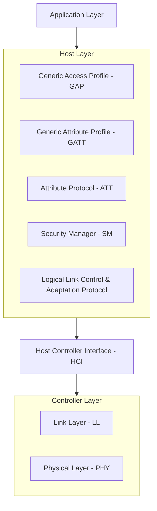

# BLE 5.0 Architecture Overview

This document provides a high-level overview of the Bluetooth Low Energy (BLE) 5.0 protocol stack architecture, dividing it into its three main blocks: Application, Host, and Controller.

## 1. System Architecture
The BLE stack is a split architecture, often implemented on a single System-on-Chip (SoC) or split across two chips (e.g., a microcontroller and a connectivity module).

### 1.1 The Controller
The Controller is the hardware-facing part of the stack, responsible for radio signals, timing, and packet transmission.
*   **Physical Layer (PHY)**: Handles the analog radio transmission (2.4 GHz ISM band).
    *   **LE 1M PHY**: The standard 1 Mbps PHY (Mandatory).
    *   **LE 2M PHY**: 2 Mbps data rate (New in 5.0).
    *   **LE Coded PHY**: Long-range with Forward Error Correction (FEC) (S=2 for 500 kbps, S=8 for 125 kbps) (New in 5.0).
*   **Link Layer (LL)**: The "brain" of the radio. Manages advertising, scanning, connections, and security at the link level.

### 1.2 The Host
The Host allows the Application and upper layers to access the Controller without needing to know the low-level details.
*   **HCI (Host Controller Interface)**: The standard protocol for communication between Host and Controller (e.g., via UART, USB, or shared memory).
*   **L2CAP**: Multiplexes data from upper layers (ATT, SM) into HCI packets. It also handles fragmentation and reassembly.
*   **SM (Security Manager)**: Generates and manages keys for encryption and authentication (Pairing & Bonding).
*   **ATT (Attribute Protocol)**: Defines how data (attributes) is accessed.
*   **GATT (Generic Attribute Profile)**: Defines the hierarchy of data (Services & Characteristics) based on ATT.
*   **GAP (Generic Access Profile)**: Defines device discovery, connection establishment, and security procedures.

### 1.3 The Application
*   **Profiles**: Standardized or custom definitions of how a device behaves (e.g., Heart Rate Profile).
*   **Application Logic**: The user code that uses the Host APIs to implement product features.

## 2. Key BLE 5.0 Features in Architecture
*   **2x Speed**: Enabled by **LE 2M PHY** in the Controller.
*   **4x Range**: Enabled by **LE Coded PHY** in the Controller.
*   **8x Broadcasting Capacity**: Enabled by **Advertising Extensions** (offloading data from the 3 adv channels to data channels) in the Link Layer.
